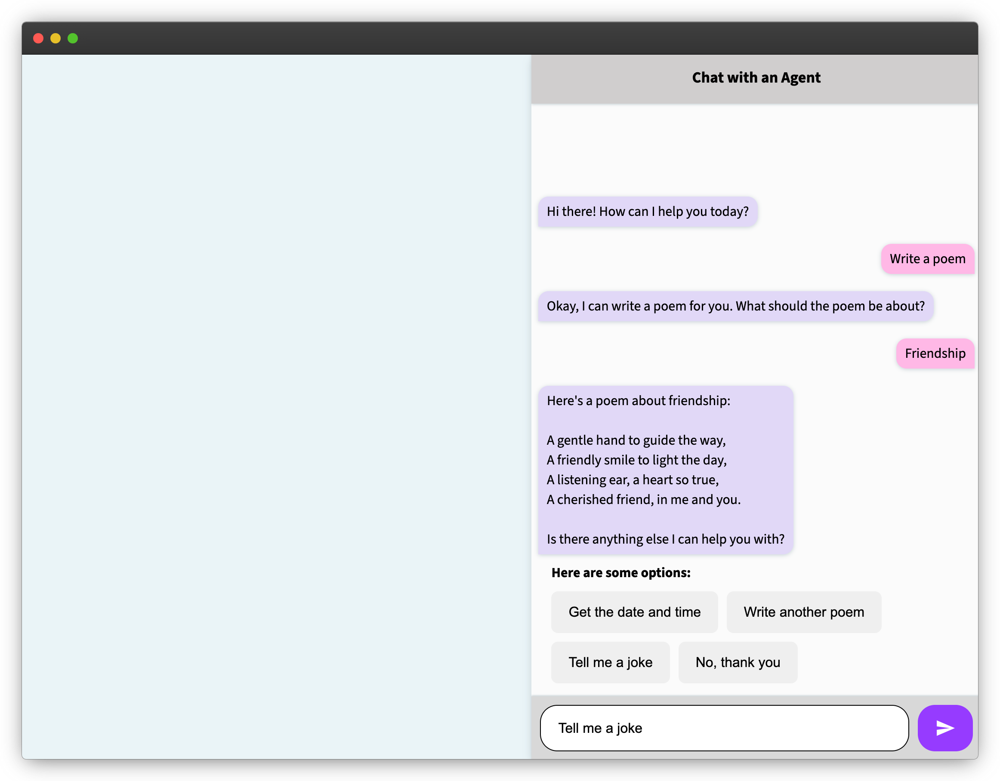

# Firebase Genkit x Angular Starter Kit

This repository contains everything you need to create an application using Firebase Genkit with Angular to build your next great application.

This example demonstrates how to use Genkit flows to create a persistent chat session with an agent. However, you can use the same patterns
in this repository to create an application that runs any arbitrary [Genkit flow](https://firebase.google.com/docs/genkit/flows) you create,
which can leverage the full Genkit API ([learn more](https://firebase.google.com/docs/genkit)).

Here's an example of the running application:

## How to get started

In order to run this example, make sure that your development environment meets the following requirements:

* Node.js v20+
* npm

This example will use the Gemini API which provides a generous free tier and does not require a credit card to get started.
To use the Gemini API, you'll need an API key. If you don't already have one, create a key in Google AI Studio.

1. [Get an API key from Google AI Studio](https://makersuite.google.com/app/apikey)
1. After you’ve created an API key, set the GEMINI_API_KEY environment variable to your key with the command `export GEMINI_API_KEY=<your API key>`
1. Clone this repository or download the code to your local machine
1. `cd` into the root folder (e.g., `cd genkit-angular-starter-kit`)
1. Install the dependencies with `npm install`
1. Serve the app with `ng serve`
1. Navigate to the development server to use the application

## Explore and build

This application uses [server-side rendering](https://angular.dev/guide/ssr) and demonstrates
how to add integrate [Genkit flows](https://firebase.google.com/docs/genkit/flows) into the
Node.js Express server Angular uses to render content.

The flow is defined in  `src/flows.ts`. Our flow, named `chatFlow` demonstrates how to use
[persistent chat sessions](https://firebase.google.com/docs/genkit/chat) to return a response from
the agent, as well as several options the user can choose from, if applicable. This application also
demonstrates how to use of [Genkit tools](https://firebase.google.com/docs/genkit/tool-calling).

The client calls the route from `src/agent.service.ts` using the `runFlow` helper method exposed
by the Genkit client.

You can customize this flow or even add new flows following this same pattern. We're excited to see what you build! Happy coding!

## Genkit Developer UI

The [Genkit Developer UI](https://firebase.google.com/docs/genkit/devtools#genkit_developer_ui) is a local web app that lets you
interactively work with models, flows, prompts, and other elements in your Genkit project. It can also serve as a useful tool for
inspecting and debugging Genkit flows in your application. You can run your app locally with the Genkit Developer UI enabled by

1. Installing the [Genkit Command Line Interface (CLI)](https://firebase.google.com/docs/genkit/devtools#command_line_interface_cli)
1. Running `npm run start:with-genkit-ui`
