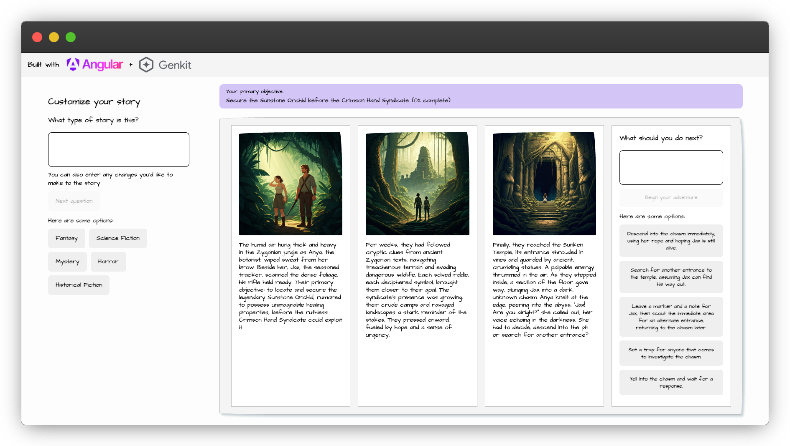

# Angular and Genkit Demo: Build your own Graphic Novel

This demo uses Angular and Genkit to create a user-driven
choose your own adventure-style graphic novel.

## Example screenshot

Here's an example screenshot from the running application:

## How to get started

In order to run this example, make sure that your development environment meets the following requirements:

* Node.js v20+
* npm

This example will use the Gemini API which provides a generous free tier and does not require a credit card to get started.
To use the Gemini API, you'll need an API key. If you don't already have one, create a key in Google AI Studio.

1. [Get an API key from Google AI Studio](https://makersuite.google.com/app/apikey)
1. After you’ve created an API key, set the `GEMINI_API_KEY` environment variable to your key with the command `export GEMINI_API_KEY=<your API key>`
1. Run `gcloud auth application-default login` to use Vertex AI features
1. Clone this repository or download the code to your local machine
1. `cd` into the root folder (e.g., `cd genkit-angular-story-generator`)
1. Install the dependencies with `npm install`
1. Serve the app with `ng serve`
1. Navigate to the development server to use the application

## Genkit Developer UI

The [Genkit Developer UI](https://firebase.google.com/docs/genkit/devtools#genkit_developer_ui) is a local web app that lets you
interactively work with models, flows, prompts, and other elements in your Genkit project. It can also serve as a useful tool for
inspecting and debugging Genkit flows in your application. You can run your app locally with the Genkit Developer UI enabled by

1. Installing the [Genkit Command Line Interface (CLI)](https://firebase.google.com/docs/genkit/devtools#command_line_interface_cli)
1. Running `npm run start:with-genkit-ui`
