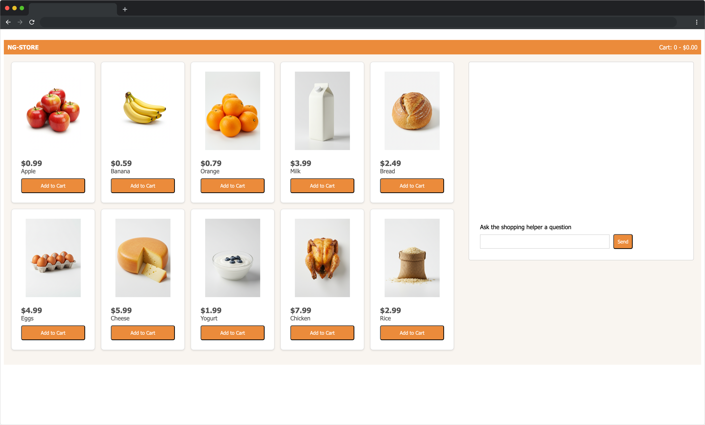

# Vertex AI in Firebase x Angular Starter Kit

This repository contains everything you need to create an application using Vertex AI in Firebase with Angular to build your next great application.

Here's an example of the running application:


## How to get started

1. Create and configure a project in Firebase. Follow the directions for [Step 1](https://firebase.google.com/docs/vertex-ai/get-started?platform=web) to create a project and a web app. Do not follow the instructions for adding the sdks, that has already been done for this repository.
1. Clone this repository or download the code to your local machine
1. `cd` into the root folder (e.g., `cd vertex-ai-firebase-angular`)
1. Take your project settings from Firebase Console and add them to `src/environments.ts`
    ```
    export const environment = {
        production: true,
        firebase: {
            /* project settings */
        },
    };
    ```
    
1. Install the dependencies with `npm install`
1. Update the Firebase project settings in `environment.ts`.
1. Run this example with `ng serve`